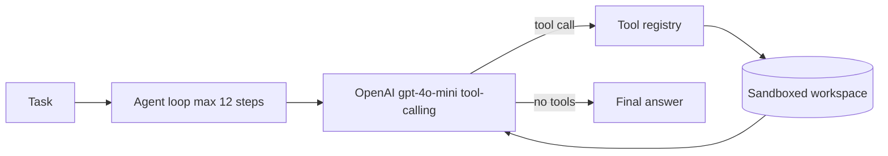

# AI Coding Agent — OpenAI + Tool-Use

[](https://github.com/TakbirZaman/Coding-Agent/actions/workflows/ci.yml)

Autonomous coding agent that plans, reads/writes code, runs shell commands safely, and verifies with tests. Built to show **LLM tool-calling, sandboxing, and agent-loop design**.

  

## Why recruiters care
- Real agent loop (think → tool → observe), not a chatbot wrapper
- 5 tools with JSON-schema function calling: `read_file, list_dir, write_file, edit_file, run_shell`
- Safety: workspace sandbox (blocks `../` escape) + dangerous-command denylist
- Verifiable: pytest suite with mocked LLM, mock mode demo without API key
- Deployable: CLI + Dockerfile + `.env.example`

## Architecture


## Quickstart
```bash
cd D:\Projects\ai-coding-agent
pip install -r requirements.txt
copy .env.example .env  # add OPENAI_API_KEY
# Mock demo (no key needed):
set AGENT_MOCK=1
python -m ai_coding_agent.cli "explore the repo and summarize" --workspace . --model gpt-4o-mini
# Real run:
python -m ai_coding_agent.cli "add docstring to tools.py" --workspace .
pytest -q
```

## Project structure
```
src/ai_coding_agent/
  agent.py  # ReAct loop
  tools.py  # sandboxed file + shell tools
  llm.py    # OpenAI wrapper + mock
  cli.py    # argparse entry
tests/      # sandbox + agent loop tests
```

## Resume bullets (copy-paste)
- Built autonomous AI coding agent in Python using OpenAI function-calling; implemented ReAct loop with 5 sandboxed tools and 12-step iteration cap.
- Hardened execution with path-traversal guard and shell denylist; added pytest suite (mocked LLM) and Docker support.

## LinkedIn post snippet
> I built an AI coding agent that reads/writes code and runs tests autonomously. Python + OpenAI tool-use + sandboxing. Repo walkthrough + demo below. Feedback welcome!

## Next steps
- [ ] streaming output, vector-memory (embeddings), GitHub PR mode
